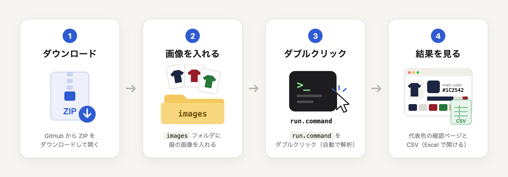

# Fashion Color Analysis

服の商品画像から **代表色を自動で取り出す** ツールです。

## Mac で使う

1. [ZIP をダウンロード](https://github.com/skuro1115/fashion-color-analysis/archive/refs/heads/main.zip)して開く
2. `images` フォルダに服の画像を入れる
3. `run.command` をダブルクリック
4. 結果のページが自動で開く（ファイルは `output` フォルダ）

> 初回だけ、準備に数分かかります。開けないときは → [困ったとき](docs/troubleshooting.md)

## 結果の例

画像ごとに **main color（いちばん面積の大きい色）** と色の割合が出ます。
自動判定があやしい画像には **review（要確認）** の印が付きます。 → [結果の見方](docs/results-guide.md)

## ドキュメント

| 知りたいこと | 見るところ |
| --- | --- |
| 最初の使い方を図で見たい | [はじめかた](docs/getting-started.md) |
| 結果の数字や印の意味 | [結果の見方](docs/results-guide.md) |
| 動かない・エラーが出た | [困ったとき](docs/troubleshooting.md) |
| **AI（Claude Code 等）で機能を変えたい** | [AI で改修する](docs/ai-customization.md) |
| 仕組み・設定・開発者向け情報 | [技術ドキュメント](docs/technical.md) |
