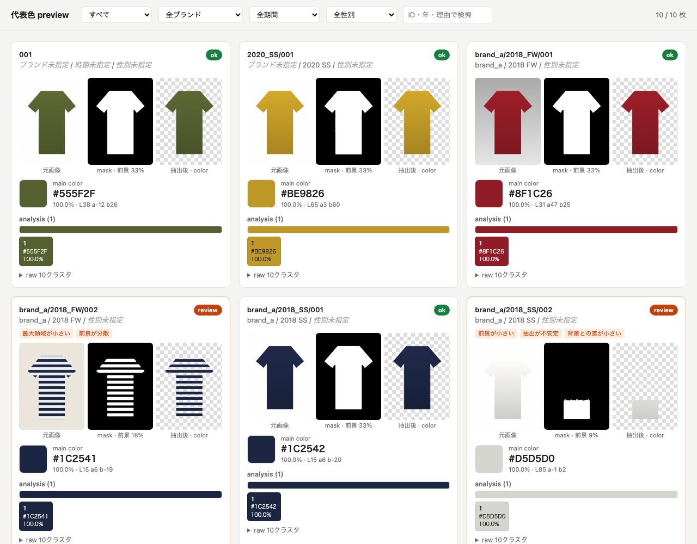

# はじめかた


---

## ① ダウンロード

[ZIP をダウンロード](https://github.com/skuro1115/fashion-color-analysis/archive/refs/heads/main.zip) → ダブルクリックで開く。

```text
fashion-color-analysis-main/
├── images/        ← ここに画像を入れる
├── samples/       ← 試し用の画像
├── run.command    ← ダブルクリックで実行
└── ...
```

> フォルダは「書類」や「デスクトップ」など、好きな場所に移してかまいません。

---

## ② images に画像を入れる

jpg / png / webp が使えます。フォルダ名から **ブランド**・**性別**・**時期（年_シーズン）** を自動で読み取ります。
**分かる情報だけ** でフォルダを作れば OK。分からないものは「未指定」として分析されます。

```text
images/
├── prada/
│   ├── women/
│   │   └── 2018_SS/
│   │       └── 001.jpg  ← ブランド + 性別 + 時期
│   └── 002.jpg          ← ブランドだけ
├── 2019_FW/
│   └── 003.jpg          ← 時期だけ
└── 004.jpg              ← 指定なし
```

| フォルダ名の例 | 読み取られ方 |
| --- | --- |
| `2018` / `2018_SS` / `2018_FW` / `2018-spring` | 時期 |
| `men` / `women` / `unisex` / `メンズ` / `レディース` | 性別 |
| それ以外（`prada`, `jil_sander` など） | ブランド |

**まず試したいとき：** `samples` の中身をすべて `images` にコピーしてください。

---

## ③ run.command をダブルクリック

黒い画面（ターミナル）が開いて、自動で進みます。何も入力しなくて大丈夫です。


### 初回だけ出るかもしれない画面

| 表示 | すること |
| --- | --- |
| 「開発元を検証できません」「Apple は検証できませんでした」 | [開き方](troubleshooting.md#runcommand-が開けない) を見る（初回のみ） |
| 「"ターミナル" が "ダウンロード" フォルダにアクセスしようとしています」 | 「許可」を押す |
| Python のインストールを求められる | [Python を入れる](troubleshooting.md#python-が見つかりません) |

---

## ④ 結果を見る

終わると、ブラウザで確認ページが自動で開きます。


実際の画面はこんな感じです。



数字や印の意味をもっと詳しく → [結果の見方](results-guide.md)

---

## 画像を増やしたら

`images` に追加して、もう一度 `run.command` をダブルクリックするだけです。2回目からはすぐ始まります。
