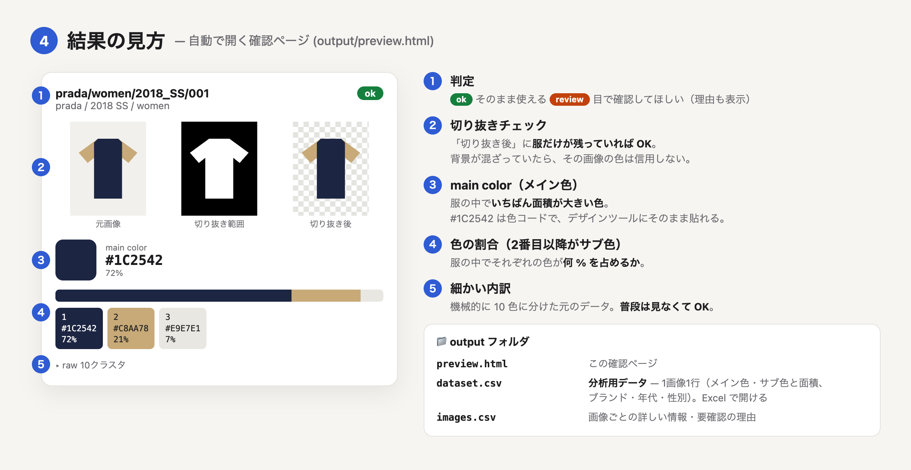

# 結果の見方

## 確認ページ（preview.html）

上のメニューで **「review のみ」** を選ぶと、確認が必要な画像だけ表示できます。

---

## 用語

| 用語 | 意味 |
| --- | --- |
| **main color** | その画像で、いちばん面積の大きい色 |
| **ratio** | その色が服の中で占める割合（0.62 = 62%） |
| **hex** | 色のコード（例 `#1C2542`）。デザインツールにそのまま貼れる |
| **r / g / b_rgb** | 色を赤・緑・青の強さ（0〜255）で表したもの |
| **review = True** | 自動判定があやしいので、目で確認してほしい画像 |
| **raw 10クラスタ** | 服の色を機械的に10色に分けた、加工前の結果 |
| **analysis** | 10色から、ごく小さい色を除いたり似た色をまとめたりした結果 |

---

## CSV ファイル

Excel や Google スプレッドシートで開けます。

### dataset.csv — 分析用データ（まずはこれを使う）

1枚の画像が1行。色とブランド・年代・性別が1行にまとまっているので、Excel でそのまま絞り込み・集計できます。

| image_id | brand | year | season | gender | main_hex | main_ratio | sub1_hex | sub1_ratio | review |
| --- | --- | --- | --- | --- | --- | --- | --- | --- | --- |
| prada/women/2018_SS/001 | prada | 2018 | SS | women | #1C2542 | 0.72 | #C8AA78 | 0.21 | False |
| gucci/2019_FW/004 | gucci | 2019 | FW | | #8F1C26 | 1.0 | | | False |

| 列 | 意味 |
| --- | --- |
| `main_hex` / `main_ratio` | **メイン色**（いちばん面積が大きい色）とその面積の割合 |
| `sub1_…` / `sub2_…` | **サブ色**（2番目・3番目に大きい色）。面積が 5% 未満なら空欄 |
| `…_r` `…_g` `…_b_rgb` | 色を赤・緑・青（0〜255）で表したもの |
| `…_L` `…_a` `…_b` | 色を「明るさ・赤み・黄み」で表したもの（色の近さを計算するとき用） |
| `all_colors` | その画像のすべての色と割合（例 `#1C2542:72.0%;#C8AA78:21.0%`） |
| `review` | `True` なら要確認。分析から外すときはこの列で絞り込む |

- `brand` / `year` / `season` / `gender` が空欄 = フォルダで指定しなかった（未指定の）画像です。
  確認ページでは「ブランド未指定」などと表示され、上のメニューで絞り込めます。
- サブ色の数や「5%」の基準は `config.yaml` の `dataset:` で変えられます。

### images.csv — 画像ごとの詳しい情報

切り抜きの指標や要確認の理由（`review_reasons`）など。`image_id` で dataset.csv とつなげられます。

### analysis_colors.csv — 画像ごとの色（縦長）

1色1行の形式です（`color_rank = 1` がメイン色）。色ごとに集計したいとき用。

### raw_colors.csv

10色に分けた加工前の結果です。通常は見なくて大丈夫です（後から設定を変えて分析し直すための元データ）。

---

## review（要確認）の理由

| 表示 | 意味 | よくある原因 |
| --- | --- | --- |
| 前景が小さい | 服として切り抜けた範囲が小さすぎる | 白背景に白い服、服が小さく写っている |
| 前景が大きすぎる | ほぼ画像全体が服と判定された | 背景と服を区別できなかった |
| 最大領域が小さい / 前景が分散 | 服がバラバラに切り抜かれた | 背景と似た色の柄（白ストライプ等） |
| 抽出が不安定 | 少し条件を変えると結果が大きく変わる | 影、背景と服の色が近い |
| 背景が複雑 | 背景が1色ではない | 部屋やスタイリングされた背景 |
| 画像端に接触 | 服が画像の端で切れている | モデル着用写真、アップの写真 |
| 背景との差が小さい | 服と背景の色が近い | グレー背景にグレーの服 |
| ピクセル不足 / 色なし | 色を取り出せる範囲がほとんどない | 上記の組み合わせ |
| 処理エラー | 画像を読み込めなかった | 壊れたファイル |

確認ページで **切り抜き後** の画像を見て、服だけが残っていれば結果はおおむね信頼できます。

---

もっと詳しい仕組み（色の計算方法など）は → [技術ドキュメント](technical.md)
