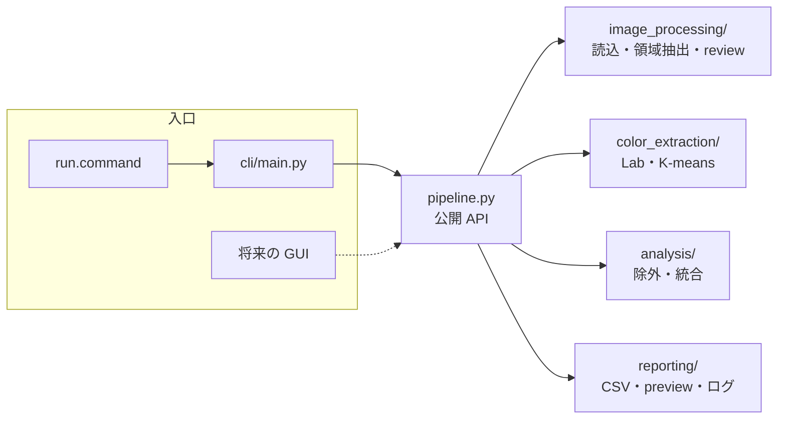

# 技術ドキュメント

開発者・研究者向けの詳細。使い方だけなら [README](../README.md) で十分です。AI で改修する場合の構成ルールは [AGENTS.md](../AGENTS.md)。

## 構成



```text
config.yaml          設定 (閾値はすべてここ。既定値は src/fca/config.py)
manifest.csv         任意。パスで足りない情報を追記
images/              入力 (git 管理外)
samples/             動作確認用の合成画像
output/              出力 (git 管理外)
├── images.csv          画像単位の情報・review 判定・抽出指標
├── raw_colors.csv      K-means k=10 の生クラスタ (一次データ)
├── analysis_colors.csv 除外・統合後の色 (color_rank=1 が main color)
├── preview.html
├── masks/  cutouts/    商品マスクと切り抜き PNG
└── logs/               実行日時・設定・バージョン・枚数の JSON / エラーログ
src/fca/
├── pipeline.py         公開 API (run_extract / run_analyze / build_preview / process_image)
├── config.py  errors.py
├── image_processing/   loader.py, segmentation.py, review.py
├── color_extraction/   colorspace.py, kmeans.py
├── analysis/           merge.py
├── reporting/          csv_io.py, preview.py, run_log.py
└── cli/                main.py
```

## コマンド (開発者向け)

```bash
uv sync
uv run fca run                 # extract -> analyze -> preview
uv run fca extract --limit 20  # 画像解析 (重い)。raw_colors.csv まで
uv run fca analyze             # raw_colors.csv の後処理だけ (画像を読まない)
uv run fca preview
uv run fca init-manifest       # manifest.csv に未登録画像の行を追記
uv run pytest -q
```

`analyze` は画像を読まないので、`config.yaml` の `analysis:` を変えて何度でもやり直せる。
run.command は `.venv-run/` に requirements.txt から環境を作り、`PYTHONPATH=src python -m fca run` を呼ぶ。

### GUI から使う場合

```python
from fca.config import load_config
from fca import pipeline

cfg = load_config("config.yaml")
pipeline.run_extract(cfg, "images", "output", progress=lambda i, n, image_id, review: ...)
pipeline.run_analyze(cfg, "output")
pipeline.build_preview("output")
```

利用者が直せるエラーは `fca.errors.UserError` (日本語メッセージ) として送出される。

## メタデータと image_id

- `brand` / `year` / `season` / `filename` はパスから取得する (`2018_SS`, `2018-FW`, `2018` などに対応)
- `image_id` は `images/` からの相対パス (拡張子なし)。例: `prada/2018_SS/001`。
  連番にしないのは、画像を追加しても既存の ID が変わらないようにするため
- `manifest.csv` は `image_id` 列だけ必須。`brand` などが空でなければパス由来の値を上書きし、
  `category` / `source_url` / `gender` などの追加列はそのまま `images.csv` に付く
- CSV は BOM 付き UTF-8 (Excel で文字化けしないため)

## 処理ロジック

### 商品領域抽出 (`image_processing/segmentation.py`)

1. 透過 PNG なら alpha をそのままマスクにする
2. 外周帯（短辺の3%）のピクセルを K-means(3) し、外周の10%以上を占める色を背景色候補とする
3. 各ピクセルと最寄りの背景色の ΔE(CIE76) が `bg_delta_e` 未満を背景候補とする
4. 背景候補のうち**外周に連結しているものだけ**を背景にする（服の内側の白などを残すため）
5. opening → closing、最大連結成分とそれに近い大きさの成分だけ残す

### 色抽出 (`color_extraction/kmeans.py`)

- マスクを 2px 内側に削ってから（輪郭の背景混じり対策）Lab に変換し K-means k=10
- 学習は最大 20,000 ピクセルのサンプル、面積と中心色は全ピクセルで再計算
- `random_state` 固定で同じ入力から同じ結果になる

### 色統合 (`analysis/merge.py`)

1. `min_cluster_ratio` 未満のクラスタを除外
2. ΔE (`ciede2000` / `cie76`) が `merge_delta_e` 未満の最近接ペアを、ピクセル数で重み付けした Lab 平均に統合（繰り返し）
3. 面積比を再計算して並べ替え。`source_clusters` にどの raw クラスタから来たかを残す

`merge_delta_e: null`（統合なし）が既定。合成画像では **CIEDE2000 で 10 前後**にすると陰影によるクラスタ分裂が1色にまとまった。実画像で調整すること。

### review 判定 (`image_processing/review.py`)

`images.csv` の `review_reasons` に理由を `;` 区切りで出力する。

| 理由 | 条件(config の review:) |
| --- | --- |
| fg_too_small / fg_too_large | 前景比率 < 15% / ≥ 90% |
| largest_component_small | 最大連結成分が画像の 5% 未満 |
| fg_scattered | 有意な成分が4個以上、または最大成分が前景の60%未満 |
| unstable_segmentation | `bg_delta_e` を ±30% 動かしたマスク同士の IoU < 0.85 |
| too_few_pixels | 前景 2,000px 未満 |
| complex_background | 外周の25%超が背景色候補で説明できない |
| fg_touches_border | 外周の30%超が前景 |
| low_fg_bg_contrast | 前景と背景の ΔE 中央値 < 15 |

## 想定される失敗パターン

| パターン | 症状 | 現状の扱い |
| --- | --- | --- |
| 白背景に白い服 | 服が背景に吸収され前景 ≒ 0 | review（fg_too_small） |
| 背景と同系色の柄（白ストライプ等） | 柄の一部が背景扱いで前景が分断 | review（fg_scattered）。main color は残る柄の色に偏る |
| 腕と胴の隙間など閉じた背景 | 背景色が服の色に混入 | `remove_enclosed_background: true` で除去可（同色の服パーツも消える恐れ） |
| 室内・スタイリング背景 | 外周の色がばらつく | review（complex_background） |
| モデル着用・画像端で切れた商品 | 肌・髪・靴も前景になる／端に接触 | review（fg_touches_border）。肌色除外は未対応 |
| 強い影・グラデーション背景 | 影が前景に含まれる | IoU 低下で review になることが多い |
| 陰影・照明ムラ | 同じ色が複数クラスタに分裂 | `merge_delta_e` で統合 |
| ホワイトバランスの違い | ブランド間で色味が系統的にずれる | 未対応（MVP 対象外） |

## 設定 (config.yaml)

| セクション | 主な項目 |
| --- | --- |
| `image` | `max_size`: 処理時の最大辺 |
| `foreground` | 背景推定・マスク処理の閾値、`min_ratio` / `max_ratio` |
| `clustering` | `k` (=10), `random_state`, `edge_erode` |
| `analysis` | `min_cluster_ratio`, `merge_delta_e`, `delta_e_metric` |
| `review` | review 判定の各閾値 |

各項目の意味は config.yaml のコメントを参照。

## 今後

- 実画像で review 率と失敗パターンを分類し、閾値を調整
- 色の正規化 (色名・色系統への分類) → `brand_year_summary.csv` の集計ステージを追加
- 必要になった段階でのみ、複雑背景向けに重いモデル (rembg / SAM 等) を別ステージとして検討
